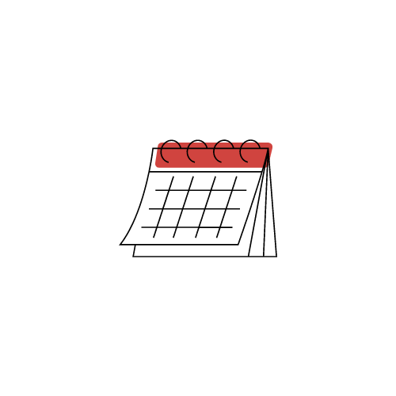
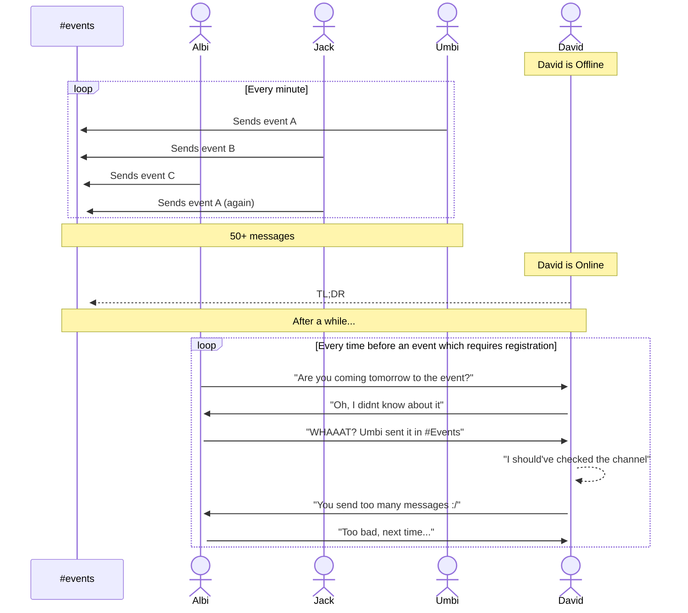
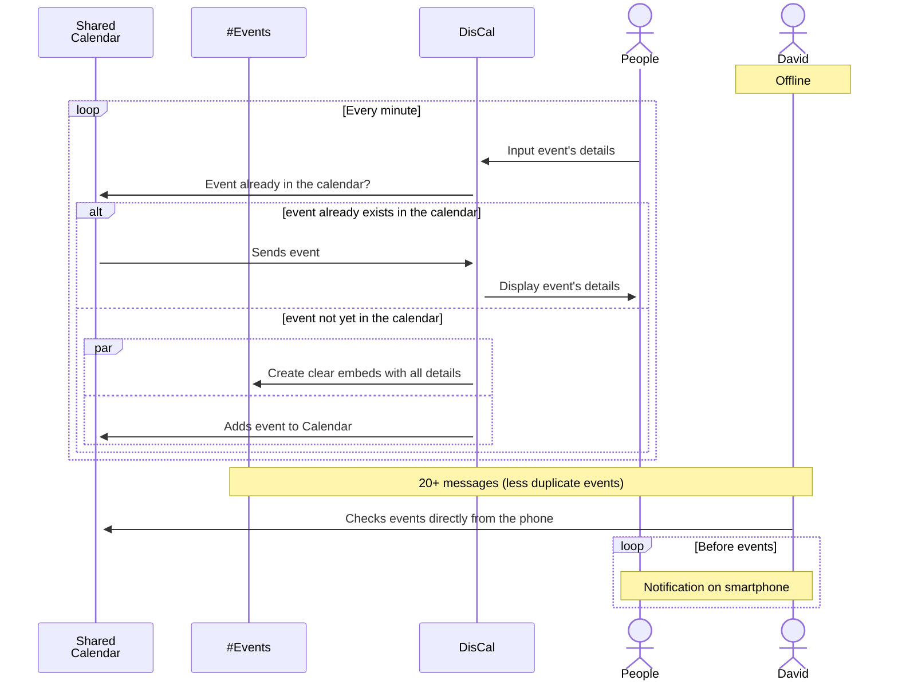

<!--! Replace `DisCal`, `DisCal`, `Add events to your Google Calendar directly from Discord`,`technology`-->

<a name="readme-top"></a>

[![Contributors][contributors-shield]][contributors-url]
[![Forks][forks-shield]][forks-url]
[![Stargazers][stars-shield]][stars-url]
[![Issues][issues-shield]][issues-url]
[![MIT License][license-shield]][license-url]


<!-- PROJECT LOGO -->
<br />
<div align="center">
  <a href="https://github.com/DavDeDev/DisCal">
    
  </a>

<h1 align="center">DisCal</h1>

  <p align="center">
    Manage your shared event calendar from Discord
    <br />
    <a href="https://github.com/DavDeDev/DisCal"><strong>Explore the docs »</strong></a>
    <br />
    <br />
    <a href="https://github.com/DavDeDev/DisCal">View Demo</a>
    ·
    <a href="https://github.com/DavDeDev/DisCal/issues">Report Bug</a>
    ·
    <a href="https://github.com/DavDeDev/DisCal/issues">Request Feature</a>
  </p>
</div>


<!-- TABLE OF CONTENTS -->
<details>
  <summary>Table of Contents</summary>
  <ol>
  <li><a  href="#project-status">Project Status</a>
  </li>
    <li>
      <a href="#about-the-project">About The Project</a>
      <ul>
        <li><a href="#built-with">Built With</a></li>
      </ul>
    </li>
    <li>
      <a href="#getting-started">Getting Started</a>
      <ul>
        <li><a href="#prerequisites">Prerequisites</a></li>
        <li><a href="#installation">Installation</a></li>
      </ul>
    </li>
    <li><a href="#usage">Usage</a></li>
    <li><a href="#roadmap">Roadmap</a></li>
    <li><a href="#contributing">Contributing</a></li>
    <li><a href="#license">License</a></li>
    <li><a href="#contact">Contact</a></li>
    <!-- <li><a href="#acknowledgments">Acknowledgments</a></li> -->
  </ol>
</details>

## Project Status

Currently, the project development has slowed down a bit due to my external commitments. I have been juggling multiple responsibilities, which has limited the amount of time I can dedicate to this project. However, I am still actively working on it and making progress whenever I have the opportunity.

If you have any questions or concerns regarding the project or its progress, please feel free to reach out to me. Thank you for your support and understanding.

<!-- ABOUT THE PROJECT -->
## About The Project

### Idea

<!-- [![Product Name Screen Shot][product-screenshot]](https://example.com) -->

Typical situation in our #events channel on Discord:



But what if...




<p align="right">(<a href="#readme-top">back to top</a>)</p>


### Built With
[](https://nodejs.org/en)
[](https://www.typescriptlang.org/)
[](https://discord.com/developers/applications)
[](https://cloud.google.com/)


<!-- !Use this as a template to add technologies -->
[Next.js]: https://img.shields.io/badge/next.js-000000?style=for-the-badge&logo=nextdotjs&logoColor=white 
[Next-url]: https://nextjs.org/

[TypeScript]: https://img.shields.io/static/v1?style=for-the-badge&message=TypeScript&color=3178C6logo=TypeScript&logoColor=FFFFFF&label=(https://www.typescriptlang.org/)
<p align="right">(<a href="#readme-top">back to top</a>)</p>


<!-- GETTING STARTED -->
## Getting Started

This instruction page assumes you already have Node.js, NPM installed

### Prerequisites

**Obtaining `credentials.json` from GCP:**

1. **Create a new project in GCP:** Go to the Google Cloud Console, create a new project, and provide a suitable name.
2. **Enable Google Calendar API:** In the GCP Console, navigate to the **API Library** by selecting Library from the sidebar menu. Search for _"Google Calendar API"_ and click on it. Then, click the _Enable_ button to activate the API for your project.
3. **Create a service account:** In the GCP Console, navigate to **IAM & Admin > Service Accounts**. Click on the **Create Service Account** button. Provide a name and description for the service account, and click **Create**. Make sure to grant the service account the necessary permissions to manage calendars by assigning the **Calendar role**.
4. **Generate and download the credentials:** After creating the service account, click on the service account's name to view its details. Navigate to the **Keys** tab, and click on **Add Key > Create new key**. Select **JSON** as the key type and click **Create**. This will download a JSON file containing the service account's credentials. Rename the downloaded file to **`credentials.json`**.
5. **Add the service account to the calendar:** Share the calendar you want to manage with the service account. In the calendar's settings, go to the **Share with specific people** section and enter the email address associated with the service account (found in the **`credentials.json`** file) to grant it access to the calendar.
6. **Place credentials.json in the project:** Move the **`credentials.json`** file to the **`/src`** directory of your project. This file will be used to authenticate and authorize your application to access the Google Calendar API.

_For additional clarification or assistance, you can refer to this [comment](https://stackoverflow.com/a/26067547/18686901) or feel free to [contact me](#contact)._

**Setup _Discord Bot_ from Discord Developer Platform:**

1. **Create a new application:** Go to the **[Discord Developer Portal](https://discord.com/developers/applications)** and log in to your Discord account. Click on the **New Application** button and provide a name for your bot.
2. **Create a bot user:** After creating the application, navigate to the **Bot** tab in the left sidebar and click on **Add Bot.** Confirm the prompt by clicking on "Yes, do it!" This will create a bot user for your application.
3. **Obtain the bot token:** Under the bot's settings, you will find the **Token** section. Click on the "Copy" button to copy the bot token. This token will be added to **`DISCORD_TOKEN`** environmental variable in the **`.env`** file.
4. **Invite the bot to your server:** Scroll up to the top of the bot's settings page and locate the **OAuth2** tab in the left sidebar. In the **Scopes** section, select the bot checkbox. This will generate a **URL** below. Copy the URL and open it in a new browser tab. From there, you can select a server to invite your bot to. Make sure to have the necessary permissions to add the bot to the selected server.


_For additional clarification or assistance, you can refer to this [comment](https://www.ionos.com/digitalguide/server/know-how/creating-discord-bot/) or feel free to [contact me](#contact)._


### Installation


1. Clone the repo
   ```sh
   git clone https://github.com/DavDeDev/DisCal.git
   ```
2. Install NPM packages
   ```sh
   npm install
   ```
3. Follow the instruction in the **`.env.example`** file
4. Deploy your Bot commands to a server:
    ```sh
    npm run deploy-commands
    ```
5. Run your bot:
    ```sh
    npm run start:dev
    ```
<p align="right">(<a href="#readme-top">back to top</a>)</p>

<!-- USAGE EXAMPLES -->
## Usage

After you run `npm run start:dev`, the bot will work as a common Discord Bot, so you can start typing `/` in the server specified in the `.env` file and commands will pop-up in the Discord UI.


<p align="right">(<a href="#readme-top">back to top</a>)</p>


<!-- ROADMAP -->
## Roadmap

- [ ] Releasing a first stable version

See the [open issues](https://github.com/DavDeDev/DisCal/issues) for a full list of proposed features (and known issues).

<p align="right">(<a href="#readme-top">back to top</a>)</p>


<!-- CONTRIBUTING -->
## Contributing

Contributions are what make the open source community such an amazing place to learn, inspire, and create. Any contributions you make are **greatly appreciated**.

If you have a suggestion that would make this better, please fork the repo and create a pull request. You can also simply open an issue with the tag "enhancement".
Don't forget to give the project a star! Thanks again!

1. Fork the Project
2. Create your Feature Branch (`git checkout -b feature/AmazingFeature`)
3. Commit your Changes (`git commit -m 'Add some AmazingFeature'`)
4. Push to the Branch (`git push origin feature/AmazingFeature`)
5. Open a Pull Request

<p align="right">(<a href="#readme-top">back to top</a>)</p>


<!-- LICENSE -->
## License

Distributed under the MIT License. See `LICENSE.txt` for more information.

<p align="right">(<a href="#readme-top">back to top</a>)</p>


<!-- CONTACT -->
## Contact

[][linkedin-url]
[](pietrocoladavid@gmail.com)
[](https://github.com/DavDeDev)

<p align="right">(<a href="#readme-top">back to top</a>)</p>


<!-- ACKNOWLEDGMENTS -->
<!-- ## Acknowledgments

* []()
* []()
* []()

<p align="right">(<a href="#readme-top">back to top</a>)</p> -->


[contributors-shield]: https://img.shields.io/github/contributors/DavDeDev/DisCal.svg?style=flat
[contributors-url]: https://github.com/DavDeDev/DisCal/graphs/contributors

[forks-shield]: https://img.shields.io/github/forks/DavDeDev/DisCal.svg?style=flat
[forks-url]: https://github.com/DavDeDev/DisCal/network/members

[stars-shield]: https://img.shields.io/github/stars/DavDeDev/DisCal.svg?style=flat
[stars-url]: https://github.com/DavDeDev/DisCal/stargazers

[issues-shield]: https://img.shields.io/github/issues/DavDeDev/DisCal.svg?style=flat
[issues-url]: https://github.com/DavDeDev/DisCal/issues

[license-shield]: https://img.shields.io/github/license/DavDeDev/DisCal.svg?style=flat
[license-url]: https://github.com/DavDeDev/DisCal/blob/main/LICENSE

[linkedin-shield]: https://img.shields.io/badge/-LinkedIn-black.svg?style=for-the-badge&logo=linkedin&colorB=555
[linkedin-url]: https://linkedin.com/in/pietrocoladavid
[product-screenshot]: images/screenshot.png

